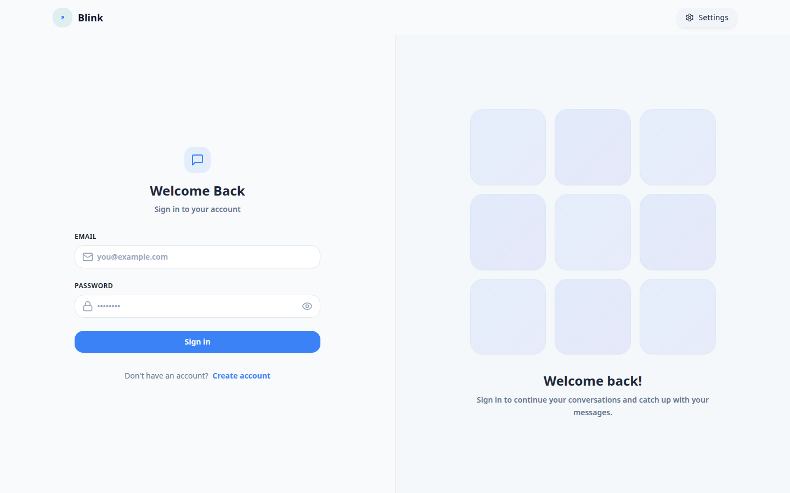
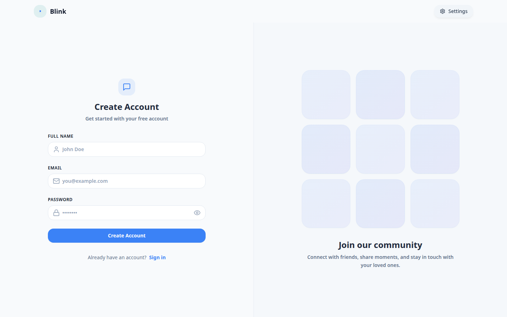
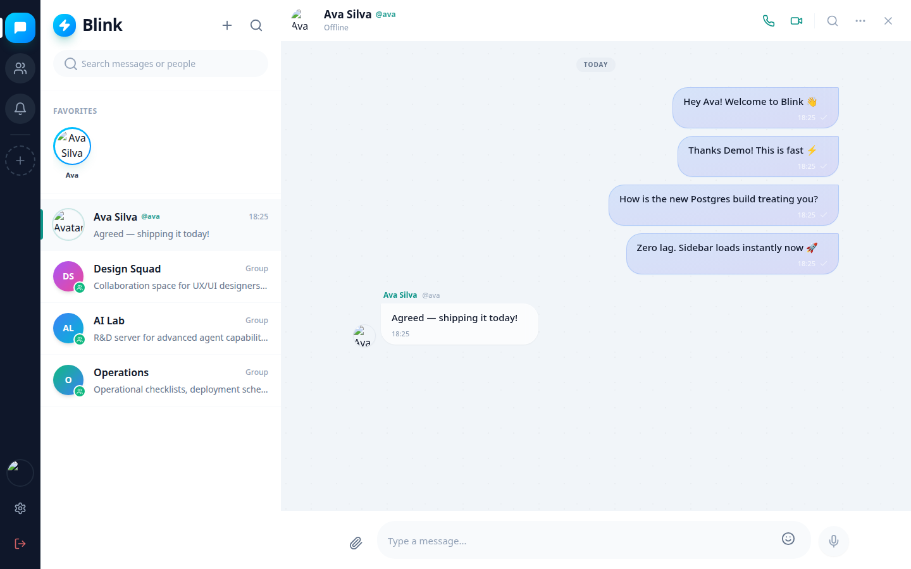

# Blink by IOP

Real-time chat app (React + Express + Socket.io) backed by **Koyeb Postgres v18** via Prisma. Ships as a single monolith: the backend serves the API, Socket.io, and the built frontend from `backend/public`.

> **Live:** [blink.koyeb.app](https://blink.koyeb.app) · **Repo:** [github.com/pansiluchethiya/blink](https://github.com/pansiluchethiya/blink)

## Screenshots

| Login | Sign up | Chat |
|-------|---------|------|
|  |  |  |

## Stack

| Layer | Technology |
|-------|-----------|
| Front-end | React 18, Vite, TailwindCSS, TypeScript |
| Back-end | Node.js 20, Express, Socket.io, TypeScript |
| Database | Koyeb Postgres v18 (Singapore) via Prisma ORM |
| Auth | JWT (httpOnly cookie) + bcrypt |
| Media | Cloudinary |
| Deploy | Single Koyeb Eco service (Dockerfile, 512MB) |

## Local dev

Prerequisites: Node.js >= 20, a Postgres database (local or Koyeb).

```bash
# clone
git clone https://github.com/pansiluchethiya/blink.git
cd blink

# env
cp .env.example backend/.env
# edit backend/.env -> set DATABASE_URL, JWT_SECRET, Cloudinary keys

# backend
cd backend && npm install
./node_modules/.bin/prisma migrate dev   # creates tables
npm run dev                                # http://localhost:5001

# frontend (separate terminal)
cd frontend && npm install && npm run dev  # http://localhost:5173
```

The frontend dev server proxies `/api` and `/socket.io` to `http://localhost:5001` (see `vite.config.ts`), so no CORS setup is needed locally.

## Production (Koyeb)

One Eco service builds the repo `Dockerfile`:

1. Frontend is built with Vite and copied into `backend/public`.
2. Backend runs `prisma migrate deploy` on boot, then starts Express + Socket.io.
3. Express serves `/api/*`, Socket.io on the same port, and the SPA fallback for everything else.

Required service env vars (Koyeb dashboard -> Service -> Environment):

| Var | Value |
|-----|-------|
| `DATABASE_URL` | Postgres connection string (Koyeb Database -> Connection details), `?sslmode=require` |
| `FRONTEND_URL` | Public app URL, e.g. `https://blink.koyeb.app` (used for CORS) |
| `JWT_SECRET` | Long random string (min 32 chars) |
| `CLOUDINARY_CLOUD_NAME` / `CLOUDINARY_API_KEY` / `CLOUDINARY_API_SECRET` | Media uploads |
| `HELP_CENTER_EMAIL` / `HELP_CENTER_PASSWORD` | Seeded support account |
| `VAPID_PUBLIC_KEY` / `VAPID_PRIVATE_KEY` / `VITE_VAPID_PUBLIC_KEY` | Web-push (optional) |

Health check: `GET /api/health` (also the Dockerfile `HEALTHCHECK`).

## Project layout

```
frontend/          # React SPA
backend/
  prisma/schema.prisma   # 11 models (User, Message, Friendship, Group, ...)
  prisma/migrations/     # applied with `prisma migrate deploy` on boot
  src/
    controllers/   # auth, message, friendship, notification, workspace, ...
    lib/prisma.ts  # Prisma singleton + _id response helpers
    middleware/    # JWT auth (Prisma-backed)
    routes/
  public/          # built frontend (Docker build only, gitignored)
Dockerfile         # single-image monolith build
```

API compatibility note: responses keep the Mongo-style `_id` field (string UUIDs), so existing clients keep working.

## License

MIT.
